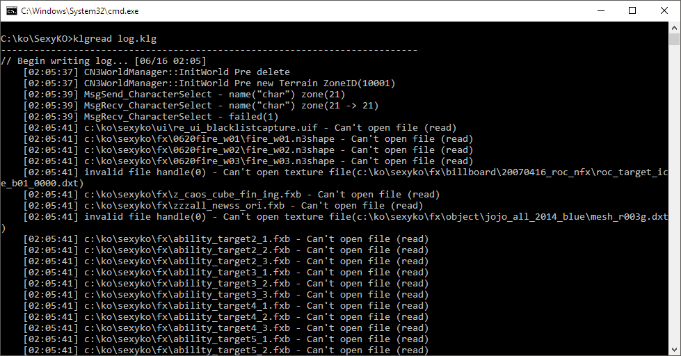

Knight Online Log Reader
==============================
Knight Online client creates log.klg but its encrypted with some algortihm. This simple software simply decodes it and outputs to stdout. It is quite fast.



Install
----------------
* install node.js
* type in terminal `npm i ko-klg-reader -g`

Usage
-----------------
* type in terminal `klgread log.klg`


Tips
----------------

You may create decrypted file by simply typing;

```sh
klgread log.klg > log.decrypt.klg
```
